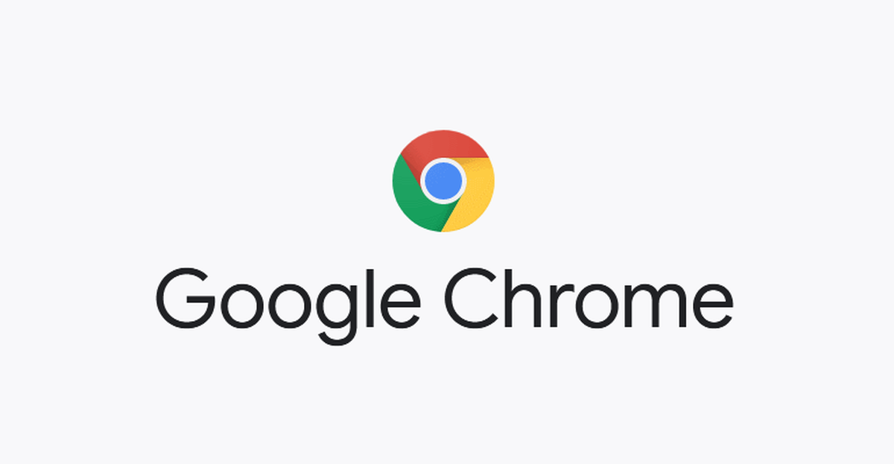
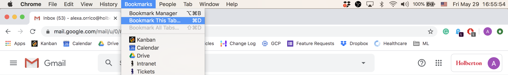

# Chrome

Chrome is a web browser developed by Google. While you can access the Intranet via other browsers, we recommend getting used to Chrome, as it is what we match in project outputs for frontend curriculum.

## Setting Up Users
After signing into one Google account, you can set up multiple users. This can be helpful if you’d like to be able to switch back and forth between google accounts for services like Gmail and Google Calendar.

You can sign into multiple users or switch accounts by going to your Chrome preferences.

## Bookmarks
Bookmarks are sites that you’ve saved. These can be saved at the top of your browser in the Bookmark Bar and you can organize them into files.

We suggest that you bookmark Gmail, Google Calendar, the Intranet, and resources that you find helpful.

To bookmark a page, click the star icon on the right of the URL or save it via the Bookmark dropdown menu.

At the minimum, you should bookmark your Gmail, your Google Calendar, and the Intranet. To organize your bookmarks, open the Bookmark Manager via the Bookmark dropdown menu.

Copyright © 2022 ALX, All rights reserved.
