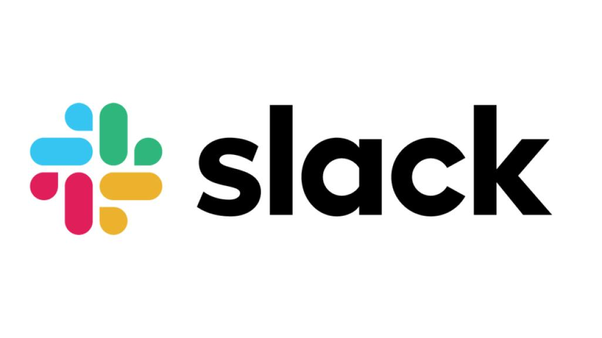
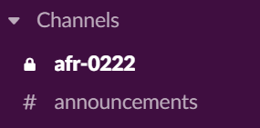
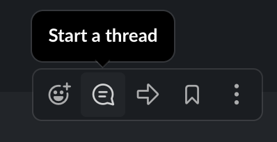

# Slack




## Introduction
At the start of a cohort, every student is given access to the ALX slack workplace; Slack will be a student’s main method of communication with their peers and staff. Navigating Slack for the first time can feel overwhelming, especially as every workplace has their own best practice. The following sections contain slack tips, tricks, and best practices.


## 0. Channels
Channels are a way for you to organize different groups of people and topics. Channels have specific purposes to help organize communication.


### Description & Topic
A channel’s description tells you what the channel is for. A channel’s topic tells you relevant information about the channel. You can view a channel’s description and topic by looking at the channel details.


### Pinned Items
Pinned Items can include important messages or documents that people have shared that may be useful to the whole channel. You can view a channel’s pinned items by clicking on the pin at the top of the channel or in the channel details. 


### Members
Channel members are those who are subscribed to a channel. If the channel is public, then users can join the channel on their own; if the channel is private, the user must be invited to that channel.

Private channels are distinguished by a lock symbol, while public channels have a hash symbol.



You can view a channel’s members by clicking on the person icon at the top of the channel or by viewing a channel’s details.


## 1. Important Channels
There is a multitude of channels; some you must be a member of while others you may want to join based on your interests.


### Local Cohort
Local cohort channels are for students in a specific cohort at a specific location. This is where students should post about any cohort AND location specific topics.
<blockquote>
    `nbo-0222` is for students in Nairobi’s cohort 5 who started in February -> `02` 2022 -> `0222`
</blockquote>


### Global Cohort
Global cohort channels are for students in a specific cohort across all locations.
<blockquote>
    cohort_5 is for students in cohort 5 across locations
</blockquote>


### Just for Fun
Here are some channels just for fun:
- `#random`
- `#meme-ology`


## 2. Posts
### Posting in a Channel
When posting in a channel, every member of that channel can see, comment on, and add emojis to the post.


### Threads
You can create a thread on a post by hovering over the post and clicking on the thread button.



Threads are used when responding to someone’s post or when adding relevant information to your own post. By using threads, users are able to better organize the overall flow of a channel/direct message. It also minimizes the alerts all members of the channel receive so only the original poster and those in the thread are notified of the response.


### Direct Messages
If you’d like to start a private conversation with one or more people, you can directly message them. You can create a new direct message by clicking on the plus button next to the direct message section in Slack’s left panel.


### Formatting Posts
There are various ways to format the text of your post. If you’re showing code, you should use a code block with ```<code here>``` (three backticks on either side).
<blockquote>
here is a code block
</blockquote>
If you’re just referencing a function or variable, you can format in-line with just one backtick on either side `<function/variable>`
<blockquote>
    I’m talking about a `function` or `variable`.
</blockquote>
By using `#<channel_name>`, you can create a link to a public channel you’d like to inform others about.
<blockquote>
    You all should check out all the announcements in the #announcements channel.
</blockquote>


### Emojis
Emojis are an easy way to comment on posts and set up informal polls. Some common emojis you’ll see in ALX’s Slack culture are:
- `:thumbs_up:` to show support for an idea
- `:100:` to say “perfect!”
- `:eyes:` to say that you’re looking at the code or link
- `:thinking_face:` to say that you’re confused

With great fun comes great responsibility. Remember to use emojis in a professional and respectful manner.


### “@“ing
When you want to ensure that specific groups of people are notified about a post, you can use the following:
- `@here` notifies all members of the channel who are currently online.
- `@channel` notifies all members of the channel. Never use this as it pings all channel members in multiple timezones.
- `@<username>` alerts the user about your message.


## 3. Settings
### Language Settings

 Manage your Slack language preferences [here](https://slack.com/help/articles/215058658-Manage-your-language-preferences).
<p align="right"><sub>Copyright © 2022 ALX, All rights reserved.</sub></p>